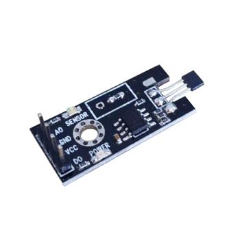
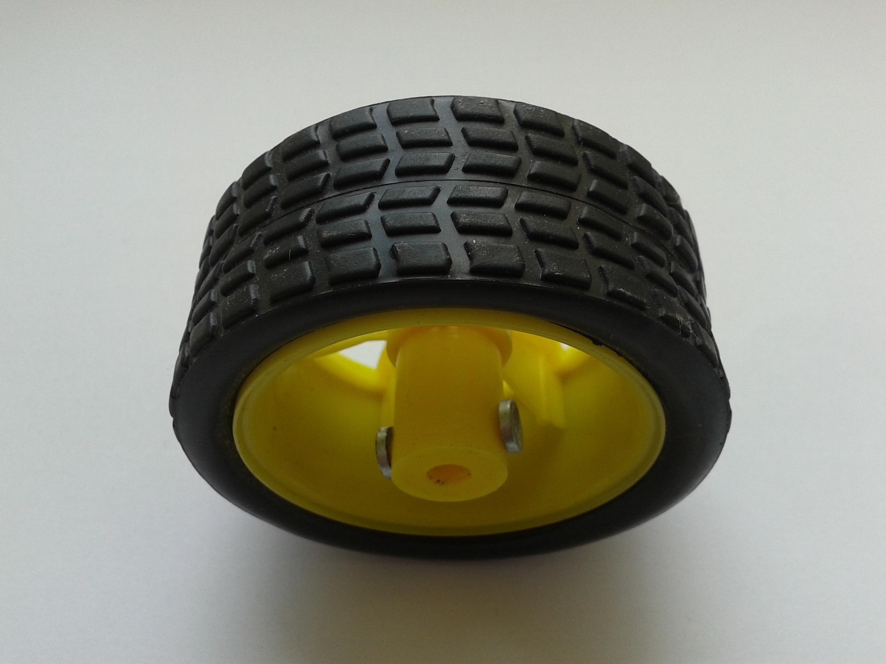

# hall_speed
Hall speed sensor driver for Linux 2.6.30

# Description

This is Linux driver for speed sensor that is based on Hall effect. It is tested on Linux 2.6.30.  
Speed is calculated using time difference between two consecutive signals and wheel diameter. Signal sourse is falling edge of voltage level on the comparator. Low voltage is detected every time when magnet goes past sensor. Magnets can be taken from small headphones.  

Module parameters:  
- wheel_diameter - diameter of wheel.  
- magnet_number - number of magnets on wheel.  
- min_speed - minimum speed measured by driver. It is required for stop detection. The higher minimal speed, the lower stop detection time.  

#Build
1. Edit compile.sh file and set architecture, path to Linux directory and path
to cross compiler.
2. Execute ./compile.sh.
